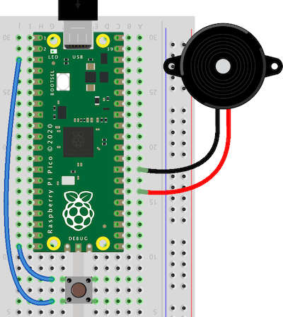

# Songs for playing on Raspberry Pi Pico

Songs to play with a buzzer connected to a Raspberry Pi Pico.

## How to use

Download play.py, melodies.py and notes.py and save them to the Pico. Easiest way to do that is using the [Thonny](https://thonny.org/) editor (here's a [guide](https://www.freva.com/transfer-files-between-computer-and-raspberry-pi-pico/)).

Then connect a buzzer to the Pico: one wire to pin 16 and the other to a ground pin, like so:

Once the buzzer is connected and the scripts are saved to the Pico, run play.py. You should hear the first tune!

In play.py you can change the volume and which track to play. Run the file again from Thonny when you change either.

## Adding a button

Because all melodies are in one file, it's easy to add a button to switch to the next track. Connect one to a ground connection and pin 15, like so:

When you push the button, the Pico will play the next song on the list. It also prints the title of that song to the shell of your editor.
If you don't have a button, then you can also make and break the connection with just a wire between those pins.

## About the speaker

The buzzer (also called piezo speaker or piezo disk) comes in two flavors: active and passive. To play melodies you need the passive kind. The active buzzers are what make the 'beep' sound in electronic devices like hand scanners. They will try to produce the same frequency 'beep' no matter what tone you ask them to play.

You can also connect an amplified speaker to those pins, if you want more volume when you play the Super Mario theme :-)

## List of tunes

 0. Star Trek intro
 1. Silent Night
 2. Pacman
 3. Ode an die Freude, Beethoven's Symphony No. 9
 4. Star Wars theme
 5. Wiegenlied (Brahms' Lullaby)
 6. Theme A from Tetris (Korobeiniki)
 7. Happy Birthday
 8. Darth Vader theme (Star Wars)
 9. Nokia Ringtone
10. Mii Channel theme
11. Minuet in G - Petzold
12. Badinerie - Johann Sebastian Bach
13. Für Elise - Ludwig van Beethoven
14. Cantina Band (Star wars)
15. Song of storms (The Legend of Zelda, Ocarina of Time)
16. The Lion Sleeps Tonight
17. The Lick
18. Canon in D - Pachelbel
19. At Doom's Gate
20. Pink Panther theme
21. Hedwig's theme (Harry Potter)
22. Jigglypuff's Song (Pokémon)
23. We Wish You a Merry Christmas
24. Keyboard cat
25. Game of Thrones
26. Greensleeves
27. Green Hill Zone (Sonic the Hedgehog)
28. The Legend of Zelda theme
29. Baby Elephant Walk
30. Bloody Tears (Castlevania II)
31. O Pulo da Gaita (Auto da Compadecida)
32. Vampire Killer (Castlevania)
33. Never Gonna Give You Up - Rick Astley
34. Take on me - A-ha
35. Prince Igor - Polovtsian Dances, Borodin
36. Zelda's Lullaby - The Legend of Zelda, Ocarina of Time
37. Super Mario Bros theme, by Koji Kondo
38. Asa branca - Luiz Gonzaga
39. The Godfather theme
40. Professor Layton's theme

## Why do I need this?

I run an electronics workshop at an art academy. I have decided to gradually switch over from the Arduino Uno to the Raspberry Pi Pico as the go-to board in my workshop. They're much faster and have more memory, are cheaper, and they run Python instead of C which is a better choice to start learning coding with. It's a nice bonus that the Pico can be programmed to act as a keyboard or mouse.

Connecting a buzzer to a microcontroller is a fun starter project. After making the first beeping sounds it's fun to also make it play songs. For Arduino there is [this fine list](https://github.com/robsoncouto/arduino-songs) of scripts to do that. To play those tunes with the Pico, it's easier to translate the scripts into the [MicroPython](https://www.raspberrypi.com/documentation/microcontrollers/micropython.html) language.

This adaptation also highlights one of the advantages of the Pico over the Arduino Uno. With the Arduino, each melody had to be a single file for it to fit on the Uno's limited flash memory of 32k bytes. That meant we had to upload a new file every time we wanted to try a different tune.
The complete list of 41 melodies (together with the script to play melodies plus the notes frequencies, 125 Kb in total) easily fits on the 2 Megabyte memory of the Pico.

## Source

This is a port of Robson Couto's list of songs for Arduino: https://github.com/robsoncouto/arduino-songs
The sources he used are mentioned in melodies.py. The script I used to scrape the melodies from the .ino files is in the archive folder.
The sounds are all monophonic. If you want more complicated tunes, try out [this repository](https://github.com/james1236/buzzer_music).
