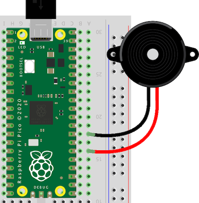

# Songs for playing on Raspberry Pi Pico

Songs to play with a buzzer connected to a Raspberry Pi Pico.

## What is this and why do I need it? 

I run an electronics workshop at an art academy. I have decided to gradually switch over from the Arduino Uno to the Raspberry Pi Pico as the go-to board in my workshop. They're much faster and have more memory, are cheaper, and they run Python instead of C which is a better choice to start learning coding with. It's a nice bonus that the Pico can be programmed to act as a keyboard or mouse.

Connecting a buzzer to a microcontroller is a fun first project. After making the first beeping sounds it's fun to also make it play songs. For Arduino there is [this fine list](https://github.com/robsoncouto/arduino-songs) of scripts to do that. To be able to use those tunes with the Pico, we need those scripts translated into the [MicroPython](https://www.raspberrypi.com/documentation/microcontrollers/micropython.html) language. 
This adaptation highlights one of the advantages of the Pico over the Arduino Uno. With the Arduino, each melody had to be a single file to fit on the Uno's limited flash memory of 32k bytes and we had to upload a new file every time we wanted to try a different tune.
The complete list of 41 melodies (together with the script to play melodies plus the notes frequencies, 124 Kb in total) easily fits on the 2 Megabyte memory of the Pico.

## How to use

Save playMelodies.py, melodies.py, notes.py and __init__.py to the Pico (using the [Thonny editor](https://thonny.org/) for instance). 

Connect a buzzer to the Pico: the red wire to pin 15 and the black wire to a GND, like so:

The buzzer (also called piezo speaker or piezo disk) comes in two flavors: active and passive. To play melodies you need the passive kind. The active buzzers are what make the 'beep' sound in electronic devices like hand scanners. They will try to produce the same frequency 'beep' no matter what tone you ask them to play.

Once the buzzer is connected and the scripts are saved to the Pico, then run playMelodies.py. You should hear something!

You can also connect an amplified speaker to those pins, if you want more volume when you play the Super Mario theme :-)

In playMelodies.py you can change the volume and which track to play. Run the file again from Thonny when you change either.

## List of tunes

 0. Game of Thrones
 1. Greensleeves
 2. Silent Night
 3. Pacman
 4. Ode an die Freude, Beethoven's Symphony No. 9 
 5. Mii Channel theme
 6. Wiegenlied (Brahms' Lullaby)
 7. Minuet in G - Petzold
 8. Badinerie - Johann Sebastian Bach
 9. Für Elise - Ludwig van Beethoven
10. Cantina Band (Star wars)
11. Song of storms (The Legend of Zelda, Ocarina of Time)
12. The Lion Sleeps Tonight
13. Theme A from Tetris (Korobeiniki)
14. Happy Birthday
15. The Lick
16. Canon in D - Pachelbel
17. Darth Vader theme (Star Wars)
18. Nokia Ringtone
19. At Doom's Gate
20. Pink Panther theme
21. Hedwig's theme (Harry Potter)
22. Jigglypuff's Song (Pokémon)
23. We Wish You a Merry Christmas
24. Keyboard cat
25. Star Trek intro
26. Green Hill Zone (Sonic the Hedgehog)
27. The Legend of Zelda theme
28. Baby Elephant Walk
29. Bloody Tears (Castlevania II)
30. Star Wars theme
31. O Pulo da Gaita (Auto da Compadecida)
32. Vampire Killer (Castlevania)
33. Never Gonna Give You Up - Rick Astley
34. Take on me - A-ha
35. Prince Igor - Polovtsian Dances, Borodin
36. Zelda's Lullaby - The Legend of Zelda, Ocarina of Time
37. Super Mario Bros theme, by Koji Kondo
38. Asa branca - Luiz Gonzaga
39. The Godfather theme
40. Professor Layton's theme

## Source

This is a port of Robson Couto's list of songs for Arduino: https://github.com/robsoncouto/arduino-songs
The sources he used are mentioned in melodies.py. The script I used to scrape the melodies from the .ino files is in the archive folder.
The sounds are all monophonic. If you want more complicated tunes, try out [this repository](https://github.com/james1236/buzzer_music).